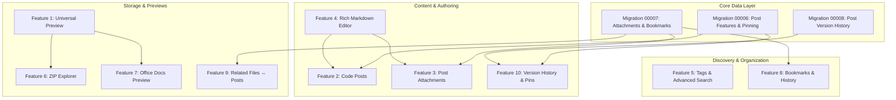
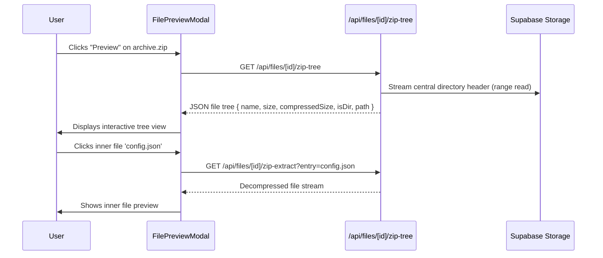

# DUMPR 10-Feature Evolution: Comprehensive Implementation Plan

> **Architectural Blueprint & Technical Specifications**  
> This document details the technical design, database migrations, API contracts, UI/UX components, and phased rollout strategy for all 10 platform enhancements in **DUMPR**.

---

## Master Feature Roadmap



---

## 1. Feature 1: Universal Full File Preview
*(PDF + Images + Text + Code + Video + Audio)*

### 1.1 Objective & Scope
Upgrade `components/storage/FilePreviewModal.tsx` and `lib/storage/preview.ts` from basic image/PDF iframe rendering to a universal in-browser media and code inspection suite.

### 1.2 Technical Specifications & Supported Formats
* **Images**: `.jpg`, `.jpeg`, `.png`, `.webp`, `.gif`, `.svg`, `.bmp`, `.ico`  
  * *Features*: Interactive zoom (25% to 400%), pan, 90° rotation, dimension display ($W \times H$).
* **PDFs**: `.pdf`  
  * *Features*: Full-height PDF viewer with built-in fallback download link.
* **Code & Config**: `.js`, `.ts`, `.tsx`, `.jsx`, `.html`, `.css`, `.json`, `.xml`, `.py`, `.sql`, `.sh`, `.yml`, `.yaml`, `.md`, `.rs`, `.go`, `.c`, `.cpp`, `.java`  
  * *Features*: Syntax highlighting via lightweight PrismJS/Tokenizer, line numbers, word-wrap toggle, copy raw content, font-size adjuster.
* **Audio**: `.mp3`, `.wav`, `.ogg`, `.flac`, `.m4a`, `.aac`  
  * *Features*: Cybernetic HTML5 audio card, waveform visualization / seek bar, playback speed selector ($0.5\times$ to $2\times$), volume controls.
* **Video**: `.mp4`, `.webm`, `.mov`, `.mkv`  
  * *Features*: Custom video player with playback controls, theater mode, picture-in-picture, and fullscreen.

### 1.3 Architecture & Component Plan
* **Backend Update (`lib/storage/preview.ts`)**:
  * Expand `PREVIEWABLE_EXTENSIONS` set with code, audio, video extensions.
  * In `app/api/files/[id]/preview/route.ts`, stream audio/video with `Accept-Ranges: bytes` support for smooth scrubbing.
* **Frontend Components**:
  * `CodePreview.tsx`: Code viewer with line numbers, copy button, and syntax styling.
  * `MediaPreview.tsx`: Unified audio/video player with responsive canvas.
  * `ImageViewer.tsx`: Zoomable, draggable image container.

---

## 2. Feature 2: Code Posts
*(Syntax Highlighting + Copy + Download + Line Numbers + Fullscreen)*

### 2.1 Objective & Scope
Transform posts into first-class developer code snippets / gists with syntax highlighting, line numbering, download, and fullscreen view.

### 2.2 Schema & Database Additions
Add columns to `public.posts`:
```sql
ALTER TABLE public.posts
  ADD COLUMN IF NOT EXISTS post_type TEXT NOT NULL DEFAULT 'article'
    CHECK (post_type IN ('article', 'code')),
  ADD COLUMN IF NOT EXISTS code_language TEXT DEFAULT NULL,
  ADD COLUMN IF NOT EXISTS code_filename TEXT DEFAULT NULL;
```

### 2.3 UI & Experience Design
* **Code Post Header**:
  * macOS-style terminal dots (red/yellow/green) or cybernetic tech pill.
  * Language badge (e.g., `TypeScript`, `Rust`, `Python`, `SQL`).
  * File name display (e.g. `supabase-auth.ts`).
  * Action controls:
    * **Copy**: Copies clean raw code with animated "Copied!" checkmark.
    * **Download**: Generates an immediate browser file download matching `code_filename`.
    * **Wrap Lines**: Toggles code wrapping.
    * **Fullscreen**: Expands code snippet into a modal reading layout.
* **Component Architecture**:
  * `CodePostCard.tsx`: Display card in feed and posts grid.
  * `CodeSnippetViewer.tsx`: Reusable syntax block with line numbers and copy mechanism.

---

## 3. Feature 3: Post Attachments
*(Attach Multiple DUMPR Files Directly to a Post)*

### 3.1 Objective & Scope
Allow admins to bind files stored in DUMPR directly to a post, creating rich documentation and release bundles where readers can preview or download attached assets.

### 3.2 Database Schema
Create a relational junction table with cascading soft-delete support:
```sql
CREATE TABLE IF NOT EXISTS public.post_attachments (
  id UUID PRIMARY KEY DEFAULT gen_random_uuid(),
  post_id UUID NOT NULL REFERENCES public.posts(id) ON DELETE CASCADE,
  file_id UUID NOT NULL REFERENCES public.files(id) ON DELETE CASCADE,
  display_order INT NOT NULL DEFAULT 0,
  created_at TIMESTAMPTZ NOT NULL DEFAULT timezone('utc'::text, now()),
  UNIQUE(post_id, file_id)
);

CREATE INDEX IF NOT EXISTS idx_post_attachments_post ON public.post_attachments(post_id);
CREATE INDEX IF NOT EXISTS idx_post_attachments_file ON public.post_attachments(file_id);
```

### 3.3 Endpoints & UI Workflow
* **API Endpoints**:
  * `GET /api/posts/[id]/attachments`: Returns list of attached file objects with size, extension, and download URLs.
  * `POST /api/posts/[id]/attachments`: Attaches an array of file IDs `{ file_ids: string[] }`.
  * `DELETE /api/posts/[id]/attachments/[fileId]`: Detaches file from post.
* **Editor Integration (`components/posts/PostEditorModal.tsx`)**:
  * "Attach Files" button opening an inline file selector modal.
  * Drag-to-reorder list of attached files with removable pills.
* **Post Reader View (`components/posts/PostDetailModal.tsx`)**:
  * "Attached Files (N)" section at the bottom.
  * One-click [Preview] opening Feature 1's universal modal without leaving the post.
  * "Download All as ZIP" action.

---

## 4. Feature 4: Rich Markdown Editor
*(Edit / Preview / Split Mode Workstation)*

### 4.1 Objective & Scope
Replace the plain `<textarea>` in `PostEditorModal` with a dual-pane Markdown workstation featuring live rendering and quick-format controls.

```
┌────────────────────────────────────────────────────────┐
│ [B] [I] [H1] [H2] [Quote] [Code] [Link] [Table] [Attach]│
├───────────────────────────┬────────────────────────────┤
│ EDIT MODE                 │ PREVIEW MODE               │
│ # Implementation Plan     │ Implementation Plan        │
│ * List item 1             │ • List item 1              │
│ ```ts                     │ ┌────────────────────────┐ │
│ const a = 42;             │ │ const a = 42;          │ │
│ ```                       │ └────────────────────────┘ │
└───────────────────────────┴────────────────────────────┘
│ Characters: 1,420 | Words: 215 | Read Time: 1 min       │
└────────────────────────────────────────────────────────┘
```

### 4.2 Key Capabilities
* **Three View Modes**:
  1. **Edit**: Full-width focused writing mode.
  2. **Preview**: Rendered typography layout.
  3. **Split**: Side-by-side synchronized view with synchronized scroll tracking.
* **Markdown Formatting Toolbar**:
  * Bold, Italic, Strikethrough, Heading 1–3, Blockquote, Code block, Unordered/Ordered List, Task list checkboxes, Table generator, Horizontal Rule.
* **DUMPR Link Inserter**:
  * "Insert File Reference": Automatically inserts markdown links or image embeds from DUMPR files (``).
* **Telemetry Bar**: Live word counter, character counter, and estimated reading time.

---

## 5. Feature 5: Tags + Advanced Search
*(Search Across Posts, Files, Code, and Tags)*

### 5.1 Objective & Scope
Expand the unified search endpoint (`app/api/search/route.ts`) and `SearchModal.tsx` to support multi-faceted filtering, tag queries, and code snippet discovery.

### 5.2 Advanced Search Operators
| Operator | Example | Behavior |
| :--- | :--- | :--- |
| `tag:` / `#` | `tag:security`, `#v1.2` | Filters items with exact tag matches |
| `type:` | `type:code`, `type:file` | Restricts search to posts, files, or code |
| `ext:` | `ext:pdf`, `ext:ts` | Filters files or code by extension |
| `min-size:` | `min-size:5mb` | Filters files larger than threshold |
| `author:` | `author:admin` | Filters by creator username |

### 5.3 Backend Search Engine Upgrade
* **PostgreSQL GIN Indexes**:
  ```sql
  CREATE INDEX IF NOT EXISTS idx_posts_tags ON public.posts USING GIN (tags);
  CREATE INDEX IF NOT EXISTS idx_files_metadata_gin ON public.files USING GIN (metadata);
  ```
* **Unified API Query**:
  Update `app/api/search/route.ts` to parse operators, execute parallel parameterized queries across `files`, `posts`, and `code`, and return ranked matches with keyword highlight snippets.

---

## 6. Feature 6: ZIP Explorer
*(Inspect & Extract Archive Contents In-Browser)*

### 6.1 Objective & Scope
Allow users to inspect files, directory structures, and file sizes inside `.zip` archives directly within the preview modal without downloading the full archive.

### 6.2 Technical Workflow


### 6.3 Libraries & Implementation
* **Libraries**: `jszip` or lightweight streaming central-directory parser.
* **Component `ZipExplorer.tsx`**:
  * Tree directory navigation with expand/collapse folders.
  * Size and compression ratio columns.
  * "Preview File" for text/images inside the zip.
  * "Extract File" button to download only the selected individual file.

---

## 7. Feature 7: DOCX / XLSX / PPTX Preview
*(In-Browser Document, Spreadsheet & Presentation Inspection)*

### 7.1 Objective & Scope
Enable seamless in-browser previewing of legacy and modern Microsoft Office documents without requiring desktop office software.

### 7.2 Technical Strategy by Format
* **DOCX (Word Documents)**:
  * Parse document XML using `mammoth` into clean, sanitized HTML.
  * Render with cybernetic document typography, maintaining headings, bold/italics, tables, and images.
* **XLSX / CSV (Excel Spreadsheets)**:
  * Parse sheet buffers into JSON grid structures.
  * Component `SpreadsheetViewer.tsx`:
    * Multi-sheet tab selector at bottom (`Sheet 1`, `Financials`, etc.).
    * Row numbers (1, 2, 3...) and column letters (A, B, C...).
    * In-table search and filtering.
* **PPTX (PowerPoint Presentations)**:
  * Extract slide deck layout, bullet outlines, and embedded slide media into a slide-by-slide carousel.
* **Fallback Protocol**:
  * When local parsing cannot fully render complex formatting, provide a single-click "Open in Microsoft Office Web Viewer" secure iframe option.

---

## 8. Feature 8: Bookmarks + Recently Viewed
*(Quick-Access Favorites & Reading History)*

### 8.1 Objective & Scope
Provide personalized navigation allowing authenticated users to bookmark important files or posts, while maintaining a local-first recently viewed trail.

### 8.2 Database Schema
```sql
CREATE TABLE IF NOT EXISTS public.user_bookmarks (
  id UUID PRIMARY KEY DEFAULT gen_random_uuid(),
  user_id UUID NOT NULL REFERENCES auth.users(id) ON DELETE CASCADE,
  item_type TEXT NOT NULL CHECK (item_type IN ('file', 'post')),
  item_id UUID NOT NULL,
  created_at TIMESTAMPTZ NOT NULL DEFAULT timezone('utc'::text, now()),
  UNIQUE(user_id, item_type, item_id)
);

CREATE INDEX IF NOT EXISTS idx_user_bookmarks_user ON public.user_bookmarks(user_id);
```

### 8.3 Architecture & UX
* **Bookmarks**:
  * Star/bookmark toggle button on file rows, post cards, and preview headers.
  * Tab in `FilesManager.tsx`: `[Files] [Trash] [Bookmarks]`.
  * Dedicated API: `GET/POST/DELETE /api/bookmarks`.
* **Recently Viewed**:
  * Stored in browser `localStorage` (`dumpr_recent_items`) with 20-item circular buffer.
  * Renders a "Jump Back In" quick-access tray on the home dashboard and in search modal.

---

## 9. Feature 9: Related Files ↔ Posts (Bi-Directional Linking)
*(Contextual Knowledge Graphs Connecting Files to Articles)*

### 9.1 Objective & Scope
Create bi-directional links connecting documentation (Posts) with binaries/data (Files) so readers of a post can see relevant files, and file viewers can see articles referencing that file.

### 9.2 Linking Logic
* **Explicit Links**: Derived directly from Feature 3 (`post_attachments`).
* **Semantic Tag Links**: If a file has tag `docker` and posts have tag `docker`, auto-suggest "Related Documentation".
* **UI Workflows**:
  * **In File Details / Preview**: A drawer section titled `"Mentioned in Posts"` lists all posts referencing this file.
  * **In Post Reader**: A sidebar card titled `"Referenced Vault Files"` links directly to the files.

---

## 10. Feature 10: Post Version History + Pinned Posts
*(Revision Snapshots, Diff Inspection & Sticky Announcements)*

### 10.1 Objective & Scope
Allow admins to pin critical announcements to the top of feeds, and track all post revisions with side-by-side diff comparisons and one-click rollback.

### 10.2 Database Schema
```sql
-- Pinned post support
ALTER TABLE public.posts
  ADD COLUMN IF NOT EXISTS is_pinned BOOLEAN NOT NULL DEFAULT false,
  ADD COLUMN IF NOT EXISTS pinned_at TIMESTAMPTZ DEFAULT NULL;

CREATE INDEX IF NOT EXISTS idx_posts_pinned ON public.posts(is_pinned, pinned_at DESC);

-- Version history snapshots
CREATE TABLE IF NOT EXISTS public.post_versions (
  id UUID PRIMARY KEY DEFAULT gen_random_uuid(),
  post_id UUID NOT NULL REFERENCES public.posts(id) ON DELETE CASCADE,
  version_number INT NOT NULL,
  title TEXT NOT NULL,
  content TEXT,
  excerpt TEXT,
  tags TEXT[],
  author_id UUID REFERENCES auth.users(id),
  change_summary TEXT DEFAULT NULL,
  created_at TIMESTAMPTZ NOT NULL DEFAULT timezone('utc'::text, now()),
  UNIQUE(post_id, version_number)
);

CREATE INDEX IF NOT EXISTS idx_post_versions_post ON public.post_versions(post_id, version_number DESC);
```

### 10.3 Versioning Workflow
1. When a post is updated via `PATCH /api/posts/[id]`:
   * The current content is snapshotted into `post_versions` before applying the update.
   * `version_number` auto-increments.
2. **Version History Modal (`PostHistoryModal.tsx`)**:
   * Lists chronological revisions with author, timestamp, and word count deltas.
   * **Diff Viewer**: Displays unified or split diff showing added/removed text.
   * **Rollback Button**: Restores the post content to any selected revision.
3. **Pinned Posts in UI**:
   * Pinned posts appear at the top of the feed and `/posts` page with a glowing emerald border and `📌 Pinned` badge.

---

## Phased Implementation Sequence

| Phase | Features Included | Core Deliverables | Dependencies |
| :--- | :--- | :--- | :--- |
| **Phase 1** | **F1, F6, F7** (Universal & Office Previews + ZIP Explorer) | Code/media viewer, ZIP tree parser, Excel grid & Docx renderer | None (Database schema unchanged) |
| **Phase 2** | **F2, F4** (Code Posts & Rich Markdown Editor) | Split-pane editor, code post card, copy/download mechanics | None |
| **Phase 3** | **F3, F9, F10** (Attachments, Linking, Versioning & Pins) | Migrations 00006–00008, attachment junction, diff history | Supabase SQL migrations |
| **Phase 4** | **F5, F8** (Bookmarks, Recently Viewed & Advanced Search) | Search operator parser, bookmark tables, GIN index tuning | Phase 3 migrations |
| **Phase 5** | **Testing & Polishing** | Vitest/Jest unit tests, a11y audit, responsiveness pass | Full feature set |
