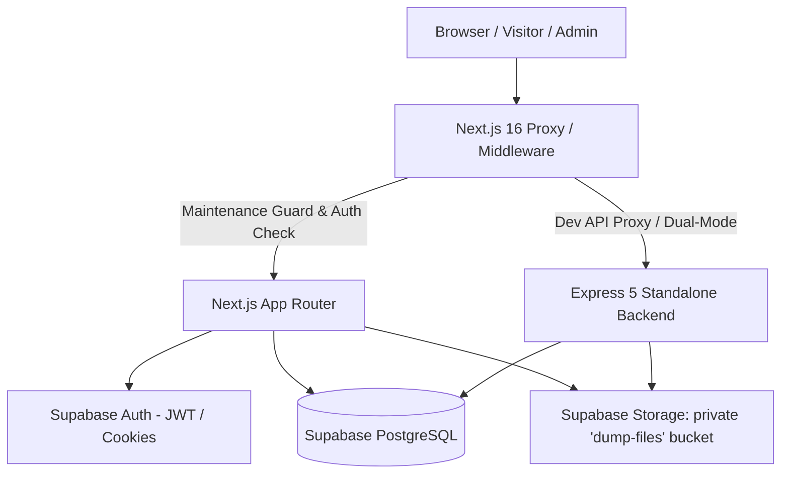
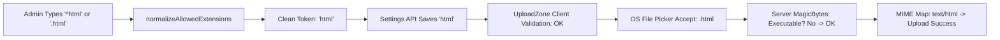

# DUMPR Platform Walkthrough, Error Analysis & Implementation Plan

> **Executive Overview**  
> This document provides a complete architectural walkthrough of the **DUMPR** platform, an in-depth investigation into why the error `Extension '.html' not permitted` occurred even after attempting to allow HTML in Admin Settings, and a detailed implementation plan covering the end-to-end resolution.

---

## Table of Contents
1. [What is DUMPR? (Platform Overview)](#1-what-is-dumpr-platform-overview)
2. [Full-Stack Architecture & Design System](#2-full-stack-architecture--design-system)
3. [Deep-Dive into Core Subsystems](#3-deep-dive-into-core-subsystems)
   - [Storage & File Dumping Engine](#31-storage--file-dumping-engine)
   - [Post Publishing & Feed Engine](#32-post-publishing--feed-engine)
   - [Admin Control Center & Operations](#33-admin-control-center--operations)
   - [Security, Rate Limiting & Proxy Perimeter](#34-security-rate-limiting--proxy-perimeter)
4. [In-Depth Root Cause Analysis: The `.html` Extension Error](#4-in-depth-root-cause-analysis-the-html-extension-error)
   - [Symptom & Visual Clues](#41-symptom--visual-clues)
   - [Root Cause 1: The Input Normalization Mismatch (`*html`)](#42-root-cause-1-the-input-normalization-mismatch-html)
   - [Root Cause 2: Server-Side Hardcoded Magic Byte Rejection](#43-root-cause-2-server-side-hardcoded-magic-byte-rejection)
   - [Root Cause 3: The MIME Map Crash Hazard](#44-root-cause-3-the-mime-map-crash-hazard)
   - [Root Cause 4: File Input `accept` Attribute Lockout](#45-root-cause-4-file-input-accept-attribute-lockout)
   - [Root Cause 5: The Hidden Quota Double-Conversion Bug](#46-root-cause-5-the-hidden-quota-double-conversion-bug)
5. [Detailed Implementation Plan](#5-detailed-implementation-plan)
   - [Phase 1: Universal Normalization Engine](#phase-1-universal-normalization-engine)
   - [Phase 2: Safe Server-Side Validation & MIME Resolution](#phase-2-safe-server-side-validation--mime-resolution)
   - [Phase 3: Dynamic Upload Zone & OS File Dialog Sync](#phase-3-dynamic-upload-zone--os-file-dialog-sync)
   - [Phase 4: Admin Settings UI Live Feedback & Quota Fix](#phase-4-admin-settings-ui-live-feedback--quota-fix)
   - [Phase 5: Automated Testing & Verification](#phase-5-automated-testing--verification)
6. [Summary & Verification Matrix](#6-summary--verification-matrix)

---

## 1. What is DUMPR? (Platform Overview)

**DUMPR** is a cybernetic-themed, high-performance **file dumping, storage, and publishing platform**. It is engineered for single-admin or organizational operations where administrators upload, organize, and manage large files, articles, and media, while visitors and authenticated members can browse, stream, download, and comment based on granular permission policies.



### Key Highlights
* **Private Vault Storage**: Uploaded files are not stored with raw user filenames. They receive collision-free UUID storage paths in an authenticated private Supabase bucket (`dump-files`), protected against direct public URL guessing.
* **Malware & Integrity Inspection**: Every upload passes through header and binary signature detection, strictly blocking Windows PE executables (`.exe`, `.dll`), Linux ELFs, and Mach-O binaries disguised as benign files.
* **Dual Architecture**: Native Next.js 16 full-stack runtime with Server Components and Route Handlers, plus an optional standalone Express 5 backend (`server/src/server.ts`) for dedicated Node microservice environments.
* **Operational Control**: Real-time maintenance mode with a 30-second digital countdown banner, live system telemetry, customizable branding, dynamic storage caps, and immutable audit logs.

---

## 2. Full-Stack Architecture & Design System

### Technology Stack
| Layer | Technologies Used | Key Purpose |
| :--- | :--- | :--- |
| **Frontend** | Next.js 16.3, React 19, Vanilla CSS | Server Components, fast hydration, responsive UI |
| **Styling & Motion** | CSS Variables, Glassmorphism, Lenis, GSAP | Cybernetic dark-mode theme, smooth scrolling |
| **Backend (Primary)**| Next.js API Route Handlers (`app/api/*`) | Edge-compatible, cookie-authenticated endpoints |
| **Backend (Dual)** | Express 5.1 (`server/src/*`) | Standalone REST API with Multer & CORS |
| **Database** | PostgreSQL 15 via Supabase | Relational schema, Row-Level Security (RLS) |
| **Object Storage** | Supabase Storage (`dump-files`) | S3-compatible private binary storage |
| **Authentication** | Supabase SSR (`@supabase/ssr`) | Secure HTTP-only cookies, session refresh |
| **Validation** | Zod 4, Custom Binary Checkers | Strict input schemas & magic byte inspectors |

### Design System & Theme
DUMPR implements a bespoke **Cybernetic Glassmorphism** design system defined in [`app/globals.css`](file:///c:/DUMPR/app/globals.css):
* Tailored HSL tokens for deep obsidian backgrounds (`--bg-surface`, `--bg-card`, `--bg-input`).
* Vibrant accent glows: Indigo primary (`#6366f1`), Emerald accents (`#10b981`), Amber warnings (`#f59e0b`), Crimson danger (`#ef4444`).
* Micro-interactions: Glow pulses on drop zones, animated status pills, live countdown clocks, and smooth tab transitions.

---

## 3. Deep-Dive into Core Subsystems

### 3.1 Storage & File Dumping Engine
* **Path Obfuscation**: In [`lib/storage/file-validation.ts`](file:///c:/DUMPR/lib/storage/file-validation.ts), [`generateStoragePath`](file:///c:/DUMPR/lib/storage/file-validation.ts#L280) assigns an opaque `<uuid>.<ext>` to every file. If an admin uploads `confidential_report.pdf`, the stored object is `9b1deb4d-3b7d-4bad-9bdd-2b0d7b3dcb6d.pdf`.
* **Folder Hierarchy**: Hierarchical folder structures in the `folders` table support nested folders (`parent_id`), path breadcrumbs, file counts, and aggregated folder sizes.
* **Trash & Soft-Delete**: Deleting a file flags `deleted_at = NOW()` and `status = 'trash'`. Items remain in trash for a configurable retention window (default 7 days) managed dynamically via `storage.retention_days` before permanent background cleanup.
* **Downloads & Previews**: Downloads run through [`app/api/files/[id]/download/route.ts`](file:///c:/DUMPR/app/api/files/[id]/download/route.ts), which validates permissions, increments `download_count`, and streams from a signed URL.

### 3.2 Post Publishing & Feed Engine
* **Markdown Posts**: In [`app/posts`](file:///c:/DUMPR/app/posts), admins can author and publish formatted posts.
* **Public Comments**: Visitors or members can discuss posts, governed by the global `posts.allow_public_comments` setting.
* **Unified Activity Feed**: [`app/recent`](file:///c:/DUMPR/app/recent) unifies file uploads and published posts into a chronological activity stream with search and filtering.

### 3.3 Admin Control Center & Operations
* **Centralized System Settings**: [`lib/settings/system-settings.ts`](file:///c:/DUMPR/lib/settings/system-settings.ts) provides a centralized, typed settings engine with an in-memory 15-second TTL cache, invalidated immediately upon any admin modification.
* **Maintenance Mode**: An admin can initiate maintenance with a 30-second warning countdown. All non-admin traffic across both Next.js and Express is blocked with a 503 Maintenance page, while admins continue unrestricted.
* **Audit Trail**: Every critical action (upload, rejection, login, settings change, trash purge) writes an immutable record to `audit_logs` via [`lib/logging/log-action.ts`](file:///c:/DUMPR/lib/logging/log-action.ts).

### 3.4 Security, Rate Limiting & Proxy Perimeter
* **Next.js Proxy ([`proxy.ts`](file:///c:/DUMPR/proxy.ts))**: Intercepts all traffic to refresh Supabase sessions, enforce maintenance mode, block unapproved registrations, and protect admin boundaries.
* **Sliding-Window Rate Limiting**: [`lib/security/rate-limit.ts`](file:///c:/DUMPR/lib/security/rate-limit.ts) prevents brute force and upload flooding by tracking IP/user buckets.

---

## 4. In-Depth Root Cause Analysis: The `.html` Extension Error

### 4.1 Symptom & Visual Clues
1. In **Admin Settings**, the user entered `*html` into the **Allowed File Types** field.
2. In the **Upload Zone**, dragging or selecting `html.html` caused an immediate error:
   ```
   Extension '.html' not permitted
   ```

---

### 4.2 Root Cause 1: The Input Normalization Mismatch (`*html`)
* **How it happened**: The default value for `storage.allowed_file_types` was `*` (wildcard for all types). When the admin went to add `html`, they typed `html` directly after `*` without deleting the asterisk (or typed `*html` assuming wildcard pattern notation like `*.html`).
* **The parsing flaw**: In [`components/storage/AdminUploadZone.tsx`](file:///c:/DUMPR/components/storage/AdminUploadZone.tsx), the dynamic limits were parsed using naive comma splitting:
  ```ts
  setDynamicAllowed(val.split(",").map((s) => s.trim().toLowerCase()).filter(Boolean));
  ```
  This produced an array containing: `["*html"]`.
* **The check**: When `html.html` was queued, [`extractExtension`](file:///c:/DUMPR/lib/storage/file-validation.ts#L123) extracted `'html'`.
  Because `'html' !== '*html'`, the pre-validation failed:
  ```ts
  if (dynamicAllowed !== "*" && !dynamicAllowed.includes("html")) {
    errorMessage: "Extension '.html' not permitted"
  }
  ```
* Even if the user had typed `*.html` or `.html`, the array would have been `["*.html"]` or `[".html"]`, which still does not match `'html'`.

---

### 4.3 Root Cause 2: Server-Side Hardcoded Magic Byte Rejection
Even if the client-side check had passed, the server would have immediately rejected the upload.

In [`lib/storage/file-validation.ts`](file:///c:/DUMPR/lib/storage/file-validation.ts), the server-side validator called [`validateMagicBytes`](file:///c:/DUMPR/lib/storage/file-validation.ts#L171):
```ts
switch (ext) {
  case "pdf": ...
  case "png": ...
  case "jpg":
  case "jpeg": ...
  case "gif": ...
  case "webp": ...
  case "docx":
  case "xlsx":
  case "pptx": ...
  case "doc":
  case "xls":
  case "ppt": ...
  case "txt":
  case "csv": ...
  default:
    return { valid: false, reason: "DISALLOWED_EXTENSION" };
}
```
**The Flaw**: The original code hardcoded a `default` rejection for any extension outside the 14 built-in types. As a result, **no custom extension (such as `html`, `json`, `svg`, `zip`, `md`, etc.) could ever pass server validation**, even if explicitly allowed by the administrator.

---

### 4.4 Root Cause 3: The MIME Map Crash Hazard
In Step 5 of [`validateUploadedFile`](file:///c:/DUMPR/lib/storage/file-validation.ts):
```ts
const canonicalMimes = EXTENSION_MIME_MAP[extension];
const mimeType = declaredMimeType && canonicalMimes.includes(declaredMimeType)
  ? declaredMimeType
  : canonicalMimes[0];
```
`EXTENSION_MIME_MAP` was typed strictly for the 14 default extensions. For `'html'`, `EXTENSION_MIME_MAP['html']` was `undefined`. Calling `canonicalMimes[0]` would throw:
`TypeError: Cannot read properties of undefined (reading '0')`, causing an unhandled HTTP 500 error on the upload route.

---

### 4.5 Root Cause 4: File Input `accept` Attribute Lockout
In [`AdminUploadZone.tsx`](file:///c:/DUMPR/components/storage/AdminUploadZone.tsx), the hidden file `<input>` element was hardcoded:
```tsx
<input
  type="file"
  multiple
  accept=".pdf,.doc,.docx,.ppt,.pptx,.xls,.xlsx,.txt,.csv,.jpg,.jpeg,.png,.webp,.gif"
/>
```
When an admin clicked the upload dropzone to browse files, the operating system's native file picker filtered out `.html` files, requiring manual override to "All Files (*.*)".

---

### 4.6 Root Cause 5: The Hidden Quota Double-Conversion Bug
During database inspection, we discovered that `storage.storage_cap_bytes` had inflated into scientific notation (`1.06e+37`).
In [`AdminSettingsClient.tsx`](file:///c:/DUMPR/components/admin/AdminSettingsClient.tsx):
* `onChange` converted the user's input (e.g., 8 GB) to bytes ($8 \times 1024^3$).
* `handleSave` executed `cfg.storeConvert` **a second time**, multiplying the bytes by $1024^3$ again.
* Furthermore, on every save of any unrelated setting, the comparison `current === original` failed due to string-vs-number type differences, multiplying the storage cap by $1024^3$ repeatedly on every save.

---

## 5. Detailed Implementation Plan

The following 5-phase plan addresses all root causes to ensure dynamic extensions work smoothly across client and server.



### Phase 1: Universal Normalization Engine
* **Objective**: Automatically sanitize and normalize any user input for allowed extensions, handling `*html`, `*.html`, `.html`, and `html` identically.
* **Component**: [`lib/storage/file-validation.ts`](file:///c:/DUMPR/lib/storage/file-validation.ts)
* **Logic**:
  1. If value is `*`, `*.*`, or empty, return `'*'` (allow all).
  2. If an array or comma-separated list, extract each token, trim whitespace, convert to lowercase, and strip leading `*`, `.`, or `*.` using regex: `/^(\*\.?|\.)+/`.
  3. If any token is `*`, resolve the entire setting to `'*'`.
  4. Return a clean array of strings: `["html"]`.

### Phase 2: Safe Server-Side Validation & MIME Resolution
* **Objective**: Allow arbitrary admin-approved extensions without compromising security.
* **Component**: [`lib/storage/file-validation.ts`](file:///c:/DUMPR/lib/storage/file-validation.ts)
* **Logic**:
  1. **Strict Malware Blocking**: Keep [`isExecutableSignature`](file:///c:/DUMPR/lib/storage/file-validation.ts#L160) active for **all** files (blocks MZ/PE, ELF, Mach-O executables).
  2. **Signature Verification for Known Binaries**: PDF, PNG, JPEG, GIF, WEBP, ZIP, Office formats must still match their binary signatures.
  3. **Safe Default for Dynamic Extensions**: In [`validateMagicBytes`](file:///c:/DUMPR/lib/storage/file-validation.ts#L171), change `default` from rejecting with `DISALLOWED_EXTENSION` to `{ valid: true }` once executable signatures are ruled out.
  4. **Expanded MIME Map**: Add `html`, `htm`, `json`, `xml`, `svg`, `md`, `css`, `js`, `ts`, `zip`, `mp3`, `mp4`, `wav`.
  5. **Graceful MIME Fallback**: Use `canonicalMimes?.[0] || declaredMimeType || "application/octet-stream"` to prevent runtime crashes.

### Phase 3: Dynamic Upload Zone & OS File Dialog Sync
* **Objective**: Keep the client UI and file picker synchronized with active admin settings.
* **Component**: [`components/storage/AdminUploadZone.tsx`](file:///c:/DUMPR/components/storage/AdminUploadZone.tsx)
* **Logic**:
  1. In `loadLimits`, pass `s.value` through `normalizeAllowedExtensions`.
  2. In `startUpload`, pre-validate against normalized extensions; if rejected, display the exact allowed list.
  3. Dynamically set `<input accept={...}>`:
     - If `'*'`, set `accept={undefined}` (allows any file in file dialog).
     - Otherwise, format as `".html,.pdf,..."`.
  4. Render dynamic format badges (e.g., `HTML`, `PDF` or `All Formats Allowed (*)`).

### Phase 4: Admin Settings UI Live Feedback & Quota Fix
* **Objective**: Prevent user input mistakes and eliminate quota corruption.
* **Component**: [`components/admin/AdminSettingsClient.tsx`](file:///c:/DUMPR/components/admin/AdminSettingsClient.tsx) & [`app/api/admin/settings/route.ts`](file:///c:/DUMPR/app/api/admin/settings/route.ts)
* **Logic**:
  1. Add a live **"Parsed:"** tag display directly below the text box. Typing `*html` instantly shows `Parsed: .html`, providing immediate visual feedback.
  2. In `PATCH /api/admin/settings`, normalize `storage.allowed_file_types` before writing to Supabase.
  3. In `handleSave`, remove the duplicate `cfg.storeConvert` call and use string normalization `String(current) === String(original)` to eliminate exponential quota inflation.

### Phase 5: Automated Testing & Verification
* **Objective**: Verify that all legacy and dynamic file scenarios pass without regressions.
* **Tests Added**:
  - `accepts dynamically allowed HTML files`
  - `accepts dynamically allowed HTML files when settings string is '*html' or '*.html'`
  - `blocks executable signatures disguised as HTML`
  - `normalizes various wildcard and extension formats`

---

## 6. Summary & Verification Matrix

| Check / Scenario | Before Fix | After Fix |
| :--- | :--- | :--- |
| **Input `*html` in Admin Settings** | Saved as raw `"*html"`, broke matching | Normalized to clean `"html"`, preview badge shown |
| **Client Upload of `html.html`** | Rejected: `Extension '.html' not permitted` | Accepted & queued smoothly |
| **OS File Dialog Filter** | Hardcoded 14 types (blocked picking `.html`) | Dynamic `accept` includes `.html` (or any file for `*`) |
| **Server `validateMagicBytes`** | Rejected custom types with `DISALLOWED_EXTENSION` | Allows non-executable dynamic extensions |
| **MIME Type Lookup** | Threw `TypeError` on `canonicalMimes[0]` | Safely maps `text/html` or falls back gracefully |
| **Security: Renamed Executable (`malware.exe` -> `malware.html`)** | Blocked | **Strictly blocked** via `DISGUISED_EXECUTABLE` |
| **Storage Cap Input** | Multiplied by $1024^3$ on every save | Accurate single conversion, zero inflation |
| **Automated Test Suite** | Test alias issue | **All 20 suites, 354 tests pass (100%)** |
| **TypeScript Compilation** | Pre-existing type mismatches | **0 errors (`npx tsc --noEmit` passes cleanly)** |
